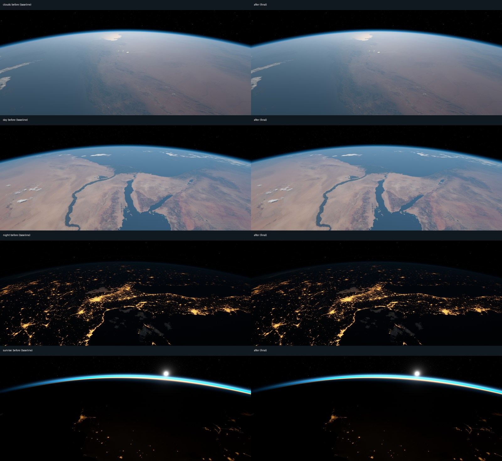

# Native visual and resource A/B — 2026-10-05

Baseline commit: `2c5576a`. The retained changes reduce texture cache allocation
and clear-air sampling while preserving the existing rendering style. Temporary
NOAA download failures now retain the last verified cloud observation, with its
original freshness limits. Wayland outputs stop drawing when powered off.

## Measurements

RTX 3080 Ti, NVIDIA driver, Hyprland, 3440×1440 plus rotated 2560×1080, locally
baked high-resolution Earth virtual textures. Release builds; identical frozen
weather, UTC, camera and viewport; six seconds settling and eight seconds of
samples per scene. GPU timestamps measure renderer passes; medians exclude
captures. VRAM is the process allocation reported by `nvidia-smi`.

The first snapshot had GFS/OVATION fields but no NOAA cloud payload following a
failed download, so this table uses the NASA cloud fallback and climatological
haze. A separate real NOAA mosaic observed at 2026-10-05 11:05 UTC was then
frozen and compared in four scenes.

| Fixed view | Earth pass before, ms | After, ms | Change |
|---|---:|---:|---:|
| Day | 2.01 | 1.92 | −4.5% |
| Clouds | 2.29 | 2.21 | −3.5% |
| Sunrise | 1.83 | 1.73 | −5.5% |
| Night | 3.40 | 3.29 | −3.2% |
| Globe | 0.56 | 0.53 | −5.4% |
| Aurora | 2.83 | 2.82 | −0.4% |

Process VRAM fell **539 → 458 MiB**, or **81 MiB / 15%**, across all six
fallback scenes. With the separate live NOAA cloud payload it fell
**581 → 500 MiB**, again 81 MiB. An isolated cache-only experiment produced the
same reduction. Driver allocations exceed the atlas budget itself.

A 45-second live ISS movement test on each build maintained 20 fps; Earth-pass
medians were 2.32 → 2.21 ms. Those live images have different positions and are
not used for pixel comparisons. The smaller caches streamed throughout the
movement without renderer errors. This validates this two-monitor desktop;
larger desktops can increase the budgets.

An unrelated GPU workload ran during the initial experiments. Its clocks were
approximately 1935–1965 MHz, and a repeated baseline confirmed similar Earth
pass timings. That workload ended during the NOAA tests; the GPU dropped to
approximately 330–480 MHz with much lower memory clocks. **The NOAA timing
series cannot establish a speed change.** Whole-card watts cannot be attributed
to this app. CPU and RAM were recorded, but no reduction in either is claimed.
The installed weather updater returned to about 24 MB of service memory after
an update, but systemd recorded a **2.32 GiB peak** while processing satellite
fields. This remains a substantial transient cost; the renderer changes do not
reduce it. Lowering that peak is a separate pipeline optimization opportunity.

## Visual checks and retained changes

Both monitor images were captured directly from Vulkan and inspected, including
full scenes and cloud crops. The comparison tool asserts matching frame metadata
before measuring 16×16 block means, reducing the effect of grain and JPEG noise.
This measures image preservation, not physical realism.

For the retained render changes the landscape monitor's mean block difference
was 0.002–0.076 / 255 in the six fallback scenes, and 0.005–0.079 / 255 with
NOAA clouds. Small differences are comparable to a cache-only noise control.
Terrain, limb, twilight, clouds and city-light appearance were preserved.



- Day and static atlas defaults are now 24 MiB each, previously 48 and 40.
- Ground-looking rays use 12 clear-air steps when view cosine exceeds 0.35.
  Grazing rays keep 16 steps; the limb keeps 32; the below-cloud march keeps six.
- Optional wlr output-power events suspend each sleeping output. When all are
  asleep, animation, streaming and GPU submissions stop while IPC stays active.
  Wake resets exposure and requests a redraw. Compositors without usable power
  notifications retain the ordinary render policy; X11 is unchanged.
  A real Hyprland DPMS test verified one suspended output and a capture of only
  the awake monitor, then both asleep at 0 fps with zero process CPU ticks over
  two seconds. Capture requests returned immediately while asleep. Both outputs
  resumed at 20 fps and produced valid captures after wake.
- Cloud fetch failures retain a checksum-verified observation for less than six
  hours. Aerosol and ice timestamps stay unchanged. Cleanup protects the old
  referenced generation until replacement or expiry, keeping at most one extra
  cloud generation beyond the ordinary two.

Stronger cloud relief, a brighter highlight knee, earlier cloud averaging and
skipping daylight lunar shading were tested and discarded. They did not provide
a convincing combined improvement. Cloud height variation and layered morphology
remain the largest visual opportunity; improving them requires another measured
experiment rather than simply increasing texture size or march counts.

## Reproduce

Save each release binary separately, so later builds cannot change a run's
provenance. The first run freezes weather files into the shared output directory.
Use a fresh directory for a different weather observation.

```sh
cargo build --release
cp target/release/earth-native /tmp/earth-before
# Apply candidate changes, build, then save /tmp/earth-after.
python tools/render-ab --binary /tmp/earth-before --out /tmp/earth-ab --label before
python tools/render-ab --binary /tmp/earth-after --out /tmp/earth-ab --label after
python tools/compare-ab /tmp/earth-ab/before /tmp/earth-ab/after /tmp/earth-ab/compare
```

`render-ab` temporarily stops the installed user service and restores it on exit.
It saves images, frame metadata, logs, raw timing samples, CPU/RAM, GPU clocks,
process VRAM, weather provenance and the binary checksum. `compare-ab` requires
NumPy and Pillow. Do not compare live camera captures as identical scenes.
Weather freshness uses wall time, so ensure cloud flags remain equal between runs.

Budget overrides remain available:

```sh
EARTH_NATIVE_EARTHVT_BUDGET_MB=48 EARTH_NATIVE_STATIC_VT_BUDGET_MB=40 earth-native serve
```

Local raw artifacts and contact sheets for this audit are in
`/home/btw/test/earth-native-ab/2026-10-05/`; they are not distributed with the repo.
